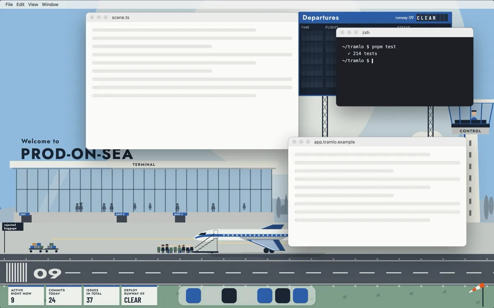
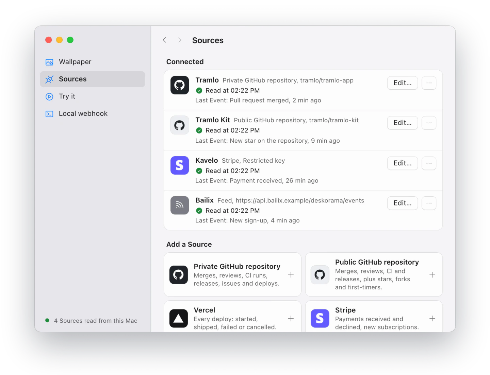
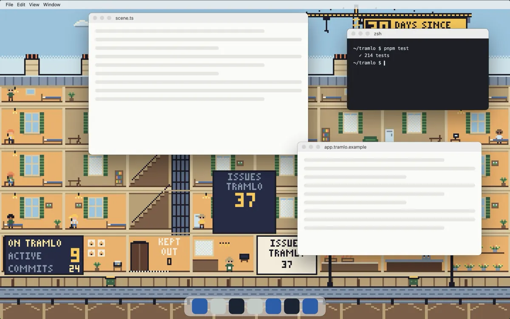
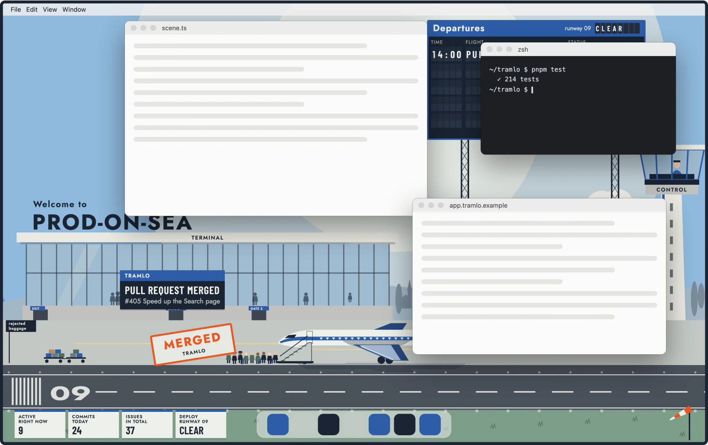
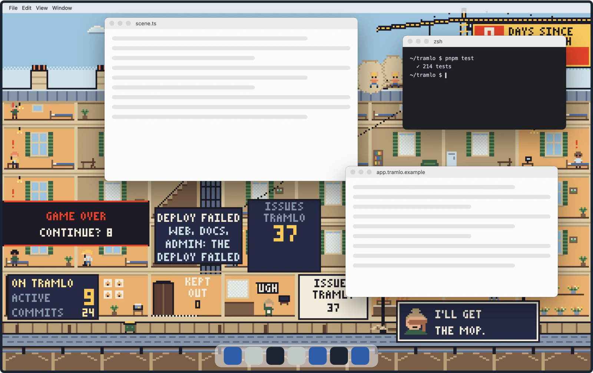
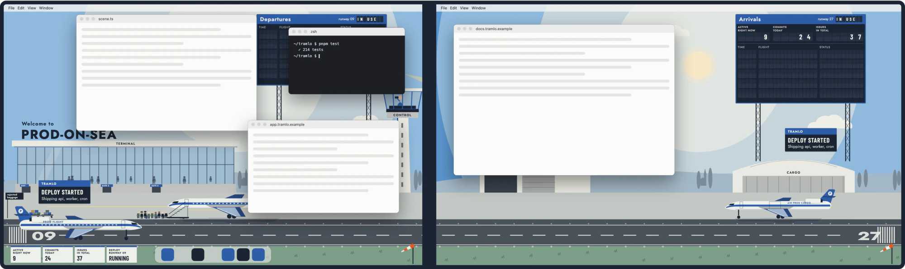

# Deskorama



An animated macOS wallpaper that reacts to the tools you plug into it. A pull request merges, CI goes red, a customer pays: a calm, funny Gag plays on your desktop, with a Caption that says what happened.

**[Download for macOS](https://github.com/samuelbelolo/deskorama/releases/latest)** · **[Try the live demo](https://samuelbelolo.github.io/deskorama/)** · **[Watch the video](https://github.com/samuelbelolo/deskorama/releases/download/v0.1.0/deskorama-launch.mp4)** (25 seconds)

## Install

1. Download the dmg from the [latest release](https://github.com/samuelbelolo/deskorama/releases/latest). It runs on Apple silicon Macs.
2. Open the dmg and drag Deskorama to Applications.
3. Open Deskorama. macOS says it cannot check the app; choose **Done**.
4. In **System Settings → Privacy & Security**, choose **Open Anyway** next to Deskorama, then confirm.

Steps 3 and 4 happen once: the app is not signed with an Apple Developer ID, so macOS asks before the first launch.

Deskorama then sits in the menu bar. **Quit Deskorama** there gives you your usual wallpaper back.

## Play your first Gag

In the menu bar, choose **Copy a test command** and paste it into a terminal. A Gag plays on your desktop.

The command posts an Event to the Local webhook. Any script on your Mac can do the same:

```sh
curl http://127.0.0.1:47213/events \
  -H "Authorization: Bearer $SECRET" -H 'Content-Type: application/json' \
  -d '{"kind":"deploy.done","archetype":"deploy","step":"succeeded","source":"My CI","text":{"en":{"label":"Deploy succeeded","detail":"v2.5.0 in production"}}}'
```

The Local webhook listens on your Mac's loopback interface only. Its secret is drawn once and kept in your Keychain, so the command still works after a restart.

## Connect your tools

Choose **Settings…** in the menu bar and add a Source. Connectors read GitHub, Vercel, Stripe, Sentry, Linear and PostHog from your Mac, with your own token. **Test** shows the latest Events before you save, and the token goes to the macOS Keychain.



To plug in your own product, expose one HTTPS address that returns your Events as JSON and add it as a Feed. The format, its JSON Schema and examples are in [docs/feed.md](docs/feed.md).

## What it looks like

Two Themes ship with the app. L'Aéroport is a 1960s airline-poster airport, cobalt and international orange. L'Immeuble is a pixel-art Paris building cut open, with its tenants and the crane on the roof.



Each kind of Event has its own Gag, and every Gag shows a Caption: the fact, then one concrete detail. A Gag plays where the windows leave the wallpaper visible.

| A pull request merges in L'Aéroport                                                                                                             | A deploy fails in L'Immeuble                                                                                                            |
| ----------------------------------------------------------------------------------------------------------------------------------------------- | --------------------------------------------------------------------------------------------------------------------------------------- |
|  |  |

With several screens, each one gets its own part of the scene, and a deploy plays on all of them.



## Try the demo

The [live demo](https://samuelbelolo.github.io/deskorama/) runs the real engine and the real Themes in your browser, on a fake desktop with fictional Sources. Trigger an Event, drag the windows around, add a second screen, switch between French and English.

To run it locally:

```sh
corepack enable
pnpm install
pnpm --filter @deskorama/demo dev
```

## How it fits together

```
Source ──▶ Connector ──▶ engine (core) ──▶ Theme, one per screen
           polls it      localises,        plays one Gag per Role,
           maps kinds    routes Events     shows a Caption
           to Roles
```

- A **Source** is a system you plug in: a GitHub repository, a SaaS, your own backend.
- A **Connector** polls it from your Mac with your own token and gives each event a **Role**: arrival, approval, money, error, deploy…
- The **engine** in `packages/core` hands each screen its Events in your language.
- A **Theme** plays one **Gag** per Role and shows its **Caption**. It never knows which Source an Event came from.

The layers, the contracts between them and the macOS app are described in [docs/architecture.md](docs/architecture.md).

## Repository

| Folder                              | What it holds                                                                                          |
| ----------------------------------- | ------------------------------------------------------------------------------------------------------ |
| `packages/core`                     | The Event shapes, the Connector, Theme and Host contracts, the Clock, the random generator, the engine |
| `packages/themes/aeroport`          | L'Aéroport: its scene, its Gags and their Captions, in French and English                              |
| `packages/themes/immeuble`          | L'Immeuble: its scene, its Gags and their Captions, in French and English                              |
| `packages/connectors/github`        | The GitHub Connectors, for a private and for a public repository                                       |
| `packages/connectors/*`             | One Connector each for Vercel, Stripe, Sentry, Linear and PostHog                                      |
| `packages/connectors/feed`          | The Feed: polls an HTTPS address of your own backend for Events in the documented JSON format          |
| `packages/connectors/local-webhook` | The Local webhook: Events from scripts on the Mac, over the loopback interface only                    |
| `packages/event-json`               | The JSON form of an Event, shared by the Feed and the Local webhook, and its validation                |
| `packages/test-utils`               | A fake host, a fake Clock, a fake `fetch`, Event fixtures and the Connector contract suite             |
| `apps/demo`                         | The browser demo, deployed to GitHub Pages                                                             |
| `apps/desktop`                      | The macOS app (Electron): a Theme window per screen, the menu bar, the settings window, the Sources    |
| `e2e`                               | Playwright drives the packaged app: an Event posted to the Local webhook shows its Caption             |

Tooling: pnpm workspace with Turborepo, TypeScript 7 (strict), Vite 8, Vitest 5 (browser mode for Themes), oxlint with type-aware rules, oxfmt, knip and dependency-cruiser. `pnpm check` runs everything CI runs.

## Contributing

See [CONTRIBUTING](.github/CONTRIBUTING.md), the [code of conduct](.github/CODE_OF_CONDUCT.md) and the [security policy](.github/SECURITY.md).

## Licence

[MIT](LICENSE). The icons the app ships, and the logos of the services it connects to, keep their own terms: see [THIRD-PARTY-NOTICES](apps/desktop/THIRD-PARTY-NOTICES.md).
