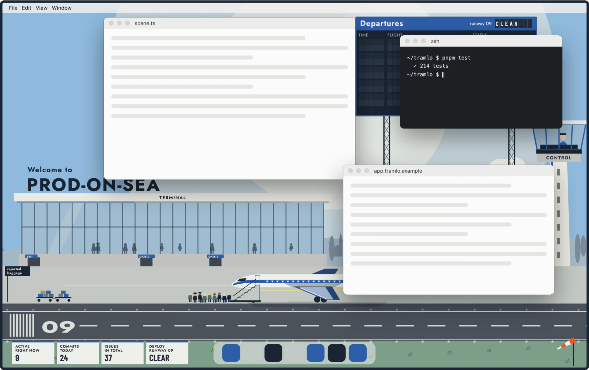
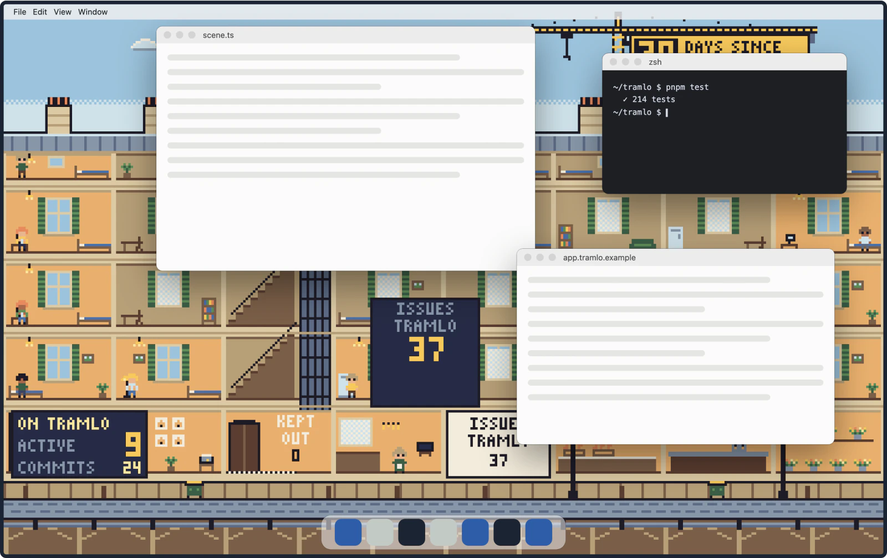
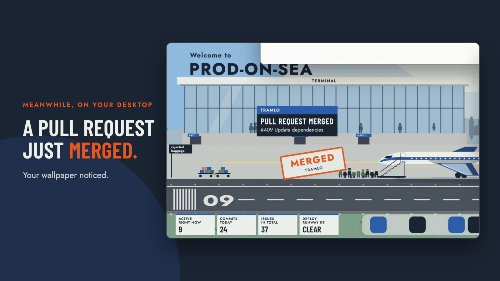

# Deskorama



An animated macOS desktop wallpaper that reacts to what happens in the systems you plug into it. A pull request merges, CI goes red, a customer pays: a calm, funny Gag plays on your desktop, with a Caption that says what happened.

**[Watch the launch video](https://github.com/samuelbelolo/deskorama/releases/download/v0.1.0/deskorama-launch.mp4)** (25 seconds) · **[Try the live demo](https://samuelbelolo.github.io/deskorama/)**

## What it looks like

Two Themes ship with the app. L'Aéroport is a 1960s airline-poster airport, cobalt and international orange. L'Immeuble is a pixel-art Paris building cut open, with its tenants and the crane on the roof.



Each kind of Event has its own Gag, and every Gag shows a Caption: the fact, then one concrete detail. A Gag plays where the windows leave the wallpaper visible.

| A pull request merges in L'Aéroport                                                                                                             | A deploy fails in L'Immeuble                                                                                                            |
| ----------------------------------------------------------------------------------------------------------------------------------------------- | --------------------------------------------------------------------------------------------------------------------------------------- |
|  |  |

With several screens, each one gets its own part of the scene, and a deploy plays on all of them.


[](https://github.com/samuelbelolo/deskorama/releases/download/v0.1.0/deskorama-launch.mp4)

The launch video is attached to the v0.1.0 release rather than kept in the repository.

## Try the demo

The [live demo](https://samuelbelolo.github.io/deskorama/) runs the real engine and the real Themes in the browser, on a fake desktop and on fictional Sources: Tramlo, a private GitHub repository that does not exist, a public one, a SaaS and a consumer app. Pick a Source and a Theme, press any button under **Trigger an event**, drag the windows around, add a second screen, and switch between French and English.

To run it locally:

```sh
corepack enable
pnpm install
pnpm --filter @deskorama/demo dev
```

## Install the macOS app

Download the dmg from this repository's latest release (Apple silicon), open it and drag Deskorama to Applications. The app is not signed by an identified developer, so the first launch takes one more step: open the app, choose **Done** when macOS says it cannot check it, then go to **System Settings → Privacy & Security** and choose **Open Anyway**. The details are in [docs/releasing.md](docs/releasing.md).

The app lives in the menu bar. Choose **Copy a test command** there and paste the command into a terminal: it sends an Event to the Local webhook, and a Gag plays on your desktop. Any script on your Mac can do the same:

```sh
curl http://127.0.0.1:47213/events \
  -H "Authorization: Bearer $SECRET" -H 'Content-Type: application/json' \
  -d '{"kind":"deploy.done","archetype":"deploy","step":"succeeded","source":"My CI","text":{"en":{"label":"Deploy succeeded","detail":"v2.5.0 in production"}}}'
```

The Local webhook listens on your Mac's loopback interface only. Its secret is drawn once and kept in your Keychain, so the command keeps working after a restart. Quitting from the menu bar gives you your usual wallpaper back.

To connect a Source, choose **Settings…** in the menu bar. Connectors read GitHub, Vercel, Stripe, Sentry, Linear and PostHog from your Mac with your own token: **Test** shows the latest Events before you save, and the token goes to the macOS Keychain.


To plug in your own product, expose one HTTPS address that returns your Events as JSON and add it as a Feed. The format, its JSON Schema and examples are in [docs/feed.md](docs/feed.md).

## How it fits together

```
Source ──▶ Connector ──▶ engine (core) ──▶ Theme, one per screen
           polls it      localises,        plays one Gag per Role,
           maps kinds    routes Events     shows a Caption
           to Roles
```

- A **Source** is a system you plug in: a GitHub repository, a SaaS, your own backend.
- A **Connector** polls it from your Mac with your own token and gives each event a **Role**: arrival, approval, money, error, deploy…
- The **engine** in `packages/core` hands each screen its Events in your language.
- A **Theme** (L'Aéroport, a 1960s airline poster airport, or L'Immeuble, a pixel-art Paris building) plays one **Gag** per Role and shows a **Caption**: the fact, then one concrete detail. It never knows which Source an Event came from.

The layers, the contracts between them and the macOS app are described in [docs/architecture.md](docs/architecture.md).

## Repository

| Folder                              | What it holds                                                                                          |
| ----------------------------------- | ------------------------------------------------------------------------------------------------------ |
| `packages/core`                     | The Event shapes, the Connector, Theme and Host contracts, the Clock, the random generator, the engine |
| `packages/themes/aeroport`          | L'Aéroport: a 1960s airline poster airport, its Gags and their Captions, in French and English         |
| `packages/themes/immeuble`          | L'Immeuble: a pixel-art Paris building cut open, its Gags and their Captions, in French and English    |
| `packages/connectors/github`        | The GitHub Connectors, for a private and for a public repository                                       |
| `packages/connectors/*`             | One Connector each for Vercel, Stripe, Sentry, Linear and PostHog                                      |
| `packages/connectors/feed`          | The Feed: polls an HTTPS address of your own backend for Events in the documented JSON format          |
| `packages/connectors/local-webhook` | The Local webhook: Events from scripts on the Mac, over the loopback interface only                    |
| `packages/event-json`               | The JSON form of an Event, shared by the Feed and the Local webhook, and its validation                |
| `packages/test-utils`               | A fake host, a fake Clock, a fake `fetch`, Event fixtures and the Connector contract suite             |
| `apps/demo`                         | The browser demo, deployed to GitHub Pages                                                             |
| `apps/desktop`                      | The macOS app (Electron): a Theme window per screen, the menu bar, the settings window, the Sources    |
| `e2e`                               | Playwright drives the packaged app: an Event posted to the Local webhook shows its Caption             |

Tooling: pnpm workspace with Turborepo, TypeScript 7 (strict), Vite 8, Vitest 5 (browser mode for Themes), oxlint with type-aware rules, oxfmt, knip and dependency-cruiser. `pnpm check` runs everything CI runs.

## Contributing

See [CONTRIBUTING](.github/CONTRIBUTING.md), the [code of conduct](.github/CODE_OF_CONDUCT.md) and the [security policy](.github/SECURITY.md).

## Licence

[MIT](LICENSE). The icons the app ships, and the logos of the services it connects to, keep their own terms: see [THIRD-PARTY-NOTICES](apps/desktop/THIRD-PARTY-NOTICES.md).
